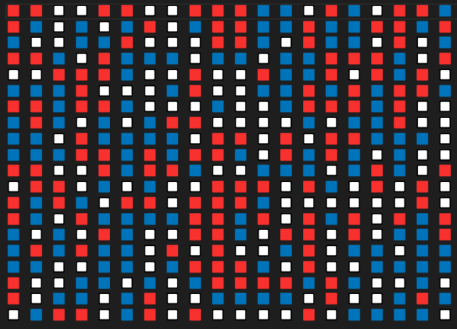
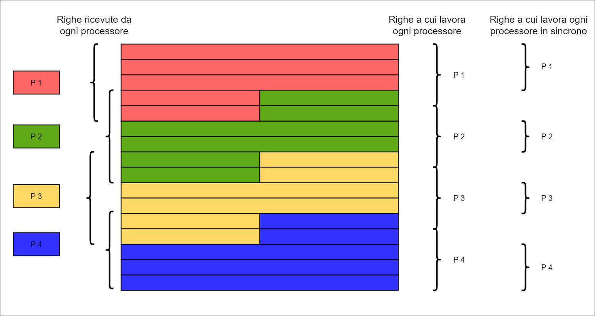
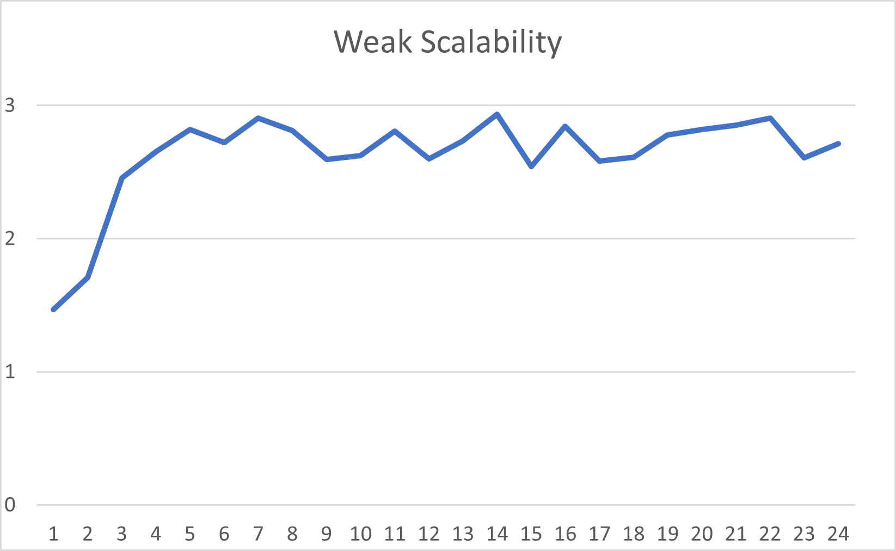

[**Schelling’s model of segregation**](https://github.com/antoniogenovese/Schelling-s-model-of-segregation-mpi)

A parallel implementation of the Shelling's model using OpenMPI.

Realizzato per il corso Programmazione Concorrente e Parallela su Cloud


# **1. Introduzione al problema**
Il modello si compone di una griglia di agenti divisi in due gruppi. Ogni agente può occupare uno spazio alla volta e il suo obiettivo è avere un vicinato la cui componente (ignorando spazi vuoti) sia per almeno il 30% appartenente al proprio gruppo.
In ogni round l'agente controlla che il suo vicinato soddisfi questo criterio, in caso contrario l'agente si trasferisce in uno spazio libero. La simulazione si interrompe dopo un numero massimo di S step oppure quando tutti gli agenti sono soddisfatti.
# **2. Soluzione proposta**
La soluzione prevede che tutti i processori lavorino equamente su sottomatrici (quasi) uguali. Possiamo distinguere la soluzione in tre parti: suddivisione della matrice, esecuzione parallela sulle sottomatrici e raccolta della matrice finale.
##     **2.1. Suddivisione della matrice**
Data la matrice iniziale M\*N e P processori, i processori 0 e P-1 riceveranno una sottomatrice di  (M/P)+1 righe, mentre per i restanti vengono assegnate (M/P)+2 righe. Inoltre, nel caso in cui M non sia multiplo di P assegniamo ai primi M%P processori una riga in più. 
##     **2.2. Esecuzione parallela**
La soluzione prevede che in ogni passo il processore 0 lavori dalla prima alla penultima riga della sua sottomatrice, il processore P-1 dalla seconda all’ultima e i restanti dalla seconda alla penultima riga della sottomatrice assegnatagli. Le righe escluse sono utilizzate esclusivamente per il controllo dei vicini delle righe adiacenti. Essendo però queste righe oggetto di lavoro di altri processori, che quindi possono cambiarle, i processori devono aspettare che gli altri P gli inviino le righe aggiornate. Per ottenere un'esecuzione più efficiente le righe non interessate a questo scambio iniziano il lavoro controllando se, per ogni cella, il vicinato rispetta i requisiti desiderati. Una volta ricevuti gli aggiornamenti dagli altri processori, si controllano le righe non ancora ispezionate. Si ripete l'esecuzione finché tutte le celle non sono soddisfatte o per un numero massimo di S passi. Alla fine, ogni processore avrà lavorato su M/P righe (+1 per i primi M%P processori).
##     **2.3. Raccolta dei dati**
Al termine degli S passi si riuniscono tutte le sottomatrici e si stampa il tempo totale di esecuzione. Quest'ultimo viene calcolato a partire dalla suddivisione della matrice fino alla raccolta delle sottomatrici da parte del processo master.
# **3. Dettagli implementativi**
La struttura dati scelta è una semplice matrice di interi per rappresentare la griglia del modello. La matrice si compone di tre gruppi: bianchi (rappresentano gli spazi vuoti, circa 20%),  blu (circa 40%) e i rossi (circa 40%).

```
     //costruzione matrice
     for (int i = 0; i < m; i++) {
         for (int j = 0; j < n; j++) {
           srand(i * n + j);
           A[i * n + j] = rand() % 5;
         }
       }
       // stampa matrice su file
       for (int i = 0; i < m; i++) {
         for (int j = 0; j < n; j++) {
           if (A[i * n + j] == 1 || A[i * n + j] == 2) { // rosso
             fprintf(fptr, "\U0001f7e5 ");
           }

           if (A[i * n + j] == 3 || A[i * n + j] == 4) { // blu
             fprintf(fptr, "\U0001f7e6 ");
           }

           if (A[i * n + j] == 0) {  // bianco
             fprintf(fptr, "\U0001f532 ");
           }
         }
         fprintf(fptr, "\n");
       }
       fprintf(fptr, "\n");

```


##     **3.1. Distribuzione dei dati**
Ogni processo lavora su due sottomatrici (lettura e scrittura) di dimensioni uguali e utilizzerà un array di dimensione N per lo scambio degli agenti.
Ogni processo chiama la funzione “def\_var” dove calcola la dimensione della sua sottomatrice, il numero di righe che lavorano in maniera sincrona, il numero di righe che riceve dalla ScatterV e il numero di righe che deve inviare nella GatherV. Inoltre, il master calcola quante e quali righe deve ricevere e inviare ogni processore alla matrice principale, variabili utili per ScatterV e GatherV. Successivamente il master effettua la ScatterV assegnando ad ogni processore la sua sottomatrice.```

```
    MPI_Scatterv( & A[0], & num_rcv[0], & displ_rcv[0], MPI_INT, & localA[0], local_rcv_num * n, MPI_INT, 0, MPI_COMM_WORLD);

```

##     **3.2. Esecuzione parallela**
All'inizio di ogni passo i processi comunicano tra loro per l'invio e la ricezione asincrona delle righe di confine, che dunque dipendono da altri processi. Nel frattempo che le comunicazioni si concludono, ogni processo lavora sulle righe intermedie della matrice, per poi attendere la fine della comunicazione e lavorare sulle righe mancanti. Le righe ricevute saranno usate solo per lavorare alle righe adiacenti ad esse.

```
     if (me == 0) {

           MPI_Isend( & localB[(local_rcv_num - 2) * n], n, MPI_INT,
             me + 1, 0, MPI_COMM_WORLD, & request[0]);
           MPI_Irecv( & localB[(local_rcv_num - 1) * n], n, MPI_INT,
             me + 1, 1, MPI_COMM_WORLD, & request[1]);

           }
         } else if (me == nproc - 1) {

           MPI_Isend( & localB[n], n, MPI_INT,
             me - 1, 1, MPI_COMM_WORLD, & request[1]);
           MPI_Irecv( & localB[0], n, MPI_INT,
             me - 1, 0, MPI_COMM_WORLD, & request[0]);

         } else {

           MPI_Isend( & localB[n], n, MPI_INT,
             me - 1, 1, MPI_COMM_WORLD, & request[1]);
           MPI_Isend( & localB[(local_rcv_num - 2) * n], n, MPI_INT,
             me + 1, 0, MPI_COMM_WORLD, & request[0]);
           MPI_Irecv( & localB[0], n, MPI_INT,
             me - 1, 0, MPI_COMM_WORLD, & request[0]);
           MPI_Irecv( & localB[(local_rcv_num - 1) * n], n, MPI_INT,
             me + 1, 1, MPI_COMM_WORLD, & request[1]);
         }

         //funzione check: controllo dei vicini delle celle appartenenti alle righe non 	di confine, non dipendono da altri processi

         MPI_Waitall(2, request, MPI_STATUSES_IGNORE);  

         //check dei vicini delle celle appartenenti alle righe di confine
         
```
La funzione check restituisce un valore intero "finito" che indica il numero di celle soddisfatte. La funzione, eseguita da ogni processore, controlla per ogni cella della sottomatrice se i vicini (non vuoti) siano per almeno il 30% appartenenti al proprio gruppo. In caso contrario scambia il valore della cella in questione con la prima posizione libera della riga. Lo swap viene effettuato utilizzando le sottomatrici (scrittura e lettura) e un array di dimensione N. Quando un valore deve essere cambiato, questo swap deve essere visibile solo nella sottomatrice in scrittura, quella in lettura non deve subire cambiamenti (questo perché il cambiamento di una riga in lettura influenzerebbe le righe successive e dal momento che i vari processori condividono le prime e le ultime due righe questi cambiamenti dovrebbero essere visti anche da loro). L'array è utilizzato per copiare inizialmente la riga in esame ed effettuare lì i vari swap.

```
    if ((double) same / (div + same) < perc) {
        int v = 0;
        while (true) {
            if (array[v] == 0) {
                localB[i * n + v] = array[j];
                array[v] = array[j];
                localB[i * n + j] = 0;
                array[j] = 0;
                break;
            }
            v++;
            if (v >= n) {
                localB[i * n + j] = array[j];
                break;
            }
        }
    }

```
A seguire della computazione sulle sottomatrici viene effettuato una Allreduce che unisce tutti i valori "finito" per ogni processore per controllare se tutte le celle della matrice principale siano soddisfatte.

```
     MPI\_Allreduce( &finito, &tot, 1, MPI\_INT, MPI\_SUM, MPI\_COMM\_WORLD);
     if (tot == m \* n) break;

```
Dopo ogni passo la matrice in scrittura e la matrice in lettura si scambiano di ruolo.
##     **3.3. Raccolta dei dati**
La parte di raccolta dei dati viene semplicemente gestita attraverso una GatherV, i cui parametri sono stati calcolati precedentemente.
```
     MPI_Gatherv( & localA[from_snd_local * n], local_snd_num * n, MPI_INT, & A[0], & num_snd[0], & displ_snd[0], MPI_INT, 0, MPI_COMM_WORLD);
 
 ```
# **4. Correttezza della soluzione**
Riguardo la correttezza sono stati creati due file C, uno per l'esecuzione sequenziale e uno per l'esecuzione parallela. I due codici stampano ad ogni passo la matrice prodotta in un file txt. Un terzo file C confronta i due file di testo stampando il risultato del controllo.
# **5. Esecuzione correttezza**
Eseguire i seguenti comandi:
```
     mpicc -o sequenz corr_sequenz.c
     mpicc -o para corr_para.c 
     mpirun --allow-run-as-root ./sequenz M N S T 
     mpirun --allow-run-as-root -np P ./para M N S T

```
Dove M è il numero di righe, N è il numero di colonne, P il numero di processori, S il numero di passi, T (da 0 a 100) la percentuale di compiacimento. Successivamente, verranno prodotti due file .txt contenenti le stampe della matrice lungo i diversi passi. 

Eseguire dunque i seguenti comandi:
```
  gcc check_correctness.c -o check
  ./check

```
L'esecuzione restituirà l'esito del confronto.
# **6. Esecuzione Benchmarks**
Riguardo l'esecuzione dei file per i benchmarks è necessario eseguire i seguenti comandi:
```
     mpicc sequenz_bench.c -o sequenz
     mpicc para_bench.c -o para
     mpirun --allow-run-as-root ./sequenz M N S T
     mpirun --allow-run-as-root -np P ./para M N S T

 ```
# **7. Raccolta Benchmark**
Per la fase di benchmarking è stato testato il comportamento sia in termini di scalabilità forte (la dimensione dell'input è costante mentre il numero di processori varia), sia in termini di scalabilità debole (per ogni test ogni processore ha sempre lo stesso carico di lavoro). Le analisi sono state effettuate su un cluster GCP di 6 nodi (e2-standard-4), ognuno con 4 vCPU e 16GB di RAM. Dunque, si hanno due file: para\_bench.c e sequenz\_bench.c che prevedono solo la stampa del tempo di esecuzione. I dati raccolti sono stati calcolati ponendo il numero di passi totali S = 100 e la percentuale di compiacimento T = 30. È inoltre importante dire che per la raccolta dei dati non si effettua il controllo ad ogni passo se la matrice è totalmente soddisfatta o meno, ma si eseguono tutti gli S passi dati in input. Ciò comporta un risparmio del tempo di esecuzione in quanto i processi non devono comunicare ad ogni passo al processo master se tutte le celle della sottomatrice sono soddisfatte. D’altra parte in questo modo la matrice si possa ordinare in un numero di passi minore di S, ma la computazione continuerebbe lo stesso. Questa scelta è stata fatta perché che con una matrice di grandi dimensioni, con il 20% di spazi bianchi e che con questo algoritmo, è poco probabile che la matrice sia soddisfatta in 100 passi. 
Per la strong scalability è stata testata una matrice 2000\*2000, per la weak scalability ogni processore lavora ad una sottomatrice 160\*2000.
##     **7.1. Strong scalability**

|**#Processori**|**Time**|**Speedup**|**Efficiency**|
| :-: | :-: | :-: | :-: |
|1|29,4352|-|1|
|2|20,852|1,41|0,92|
|3|20,5184|1,43|0,47|
|4|15,4952|1,89|0,47|
|5|12,5444|2,34|0,46|
|6|10,4892|2,80|0,46|
|7|9,2844|3,17|0,45|
|8|8,424|3,49|0,43|
|9|7,578|3,88|0,43|
|10|6,8816|4,27|0,42|
|11|6,3076|4,66|0,42|
|12|5,8568|5,02|0,41|
|13|5,4292|5,42|0,41|
|14|4,938|5,96|0,42|
|15|4,7456|6,20|0,41|
|16|4,4404|6,62|0,41|
|17|4,354|6,76|0,39|
|18|4,13|7,12|0,39|
|19|3,8732|7,59|0,39|
|20|3,6904|7,97|0,39|
|21|3,5652|8,25|0,39|
|22|3,4784|8,46|0,38|
|23|3,4504|8,53|0,37|
|24|3,4116|8,62|0,35|


Dai risultati ottenuti si evince uno speedup “rallentato” dall'overhead di comunicazione, che prevede ad ogni step lo scambio delle righe di confine. Inoltre, come ci si aspettava, all'aumentare del numero di processi, il tempo di esecuzione decresce appiattendosi verso la fine.
Anche l’efficienza risente dell’overhead di comunicazione, nonostante sia comunque abbastanza stabile, ciò dovuto al numero costante di elementi che vengono scambiati. Infatti, indipendentemente dal numero di processi o di righe in input, il processo i-esimo comunicherà sempre e solo le 4 righe di confine.
##     **7.2. Weak scalability**

|**#Processori**|**Time**|
| :-: | :-: |
|1|1,46|
|2|1,7|
|3|2,45|
|4|2,65|
|5|2,82|
|6|2,72|
|7|2,90|
|8|2,81|
|9|2,59|
|10|2,62|
|11|2,80|
|12|2,59|
|13|2,73|
|14|2,93|
|15|2,54|
|16|2,84|
|17|2,58|
|18|2,60|
|19|2,77|
|20|2,81|
|21|2,85|
|22|2,90|
|23|2,60|
|24|2,71|

Come già affermato precedentemente, il workload scelto per ogni processo è di una matrice di dimensioni 2000\*160, dunque ogni processo va a lavorare su 320.000 celle, gli altri valori invece, sono gli stessi della strong scalability. Ogni esperimento ha previsto l'incremento delle sole colonne della matrice ( 2000x160 per 1 p, 2000x320 per 2 p, 2000\*480 per 3 p, ...).



# **8. Conclusioni**
Per concludere, l'algoritmo giova sicuramente dalla parallelizzazione, anche se non appieno, causa le comunicazioni ad ogni step che rallentano i tempi limitando lo speedup. Per il resto, l'utilizzo di procedure non bloccanti e strategie atte al "risparmio" di memoria ha permesso di ottenere comunque buoni risultati. Ovviamente il controllo ad ogni passo sullo stato di soddisfacimento della matrice avrebbe portato ad altre comunicazioni aumentando l’overhead.
